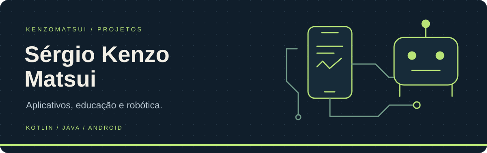
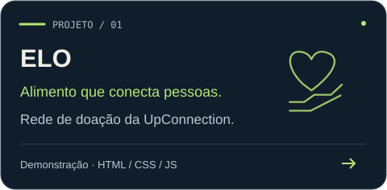
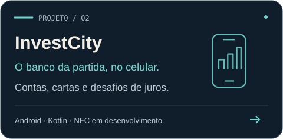
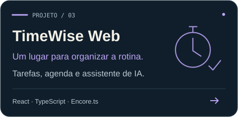
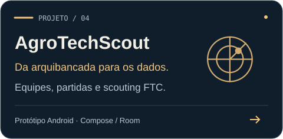
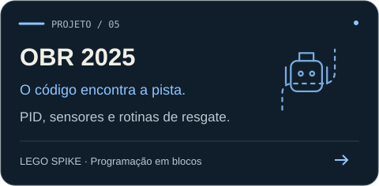
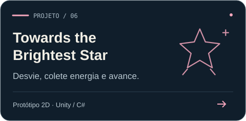

## Olá, eu sou o Sérgio Kenzo.

**Sérgio Kenzo Matsui Carnelós**

Meus projetos passam por **aplicativos, educação, jogos e robótica**. Por aqui tem um banco para jogos de tabuleiro, ferramentas para organizar a rotina e programas que levam o código para o robô.

**Kotlin · Java · TypeScript · C#**  
Concórdia, Santa Catarina, Brasil

### Explore a bancada

Aplicativos para o dia a dia, ideias para a sala de aula e código que chega à pista. **Clique em um projeto para explorar.**

  
  

  
  

  
  

Sobre o estágio dos projetos

- **ELO:** interface de demonstração e material de integração com Lovable/Supabase.
- **InvestCity:** banco do jogo implementado; integração NFC em desenvolvimento.
- **TimeWise Web:** frontend e backend disponíveis; exige configuração dos serviços externos.
- **AgroTechScout:** protótipo de scouting; campos e pontuação precisam ser ajustados à temporada.
- **OBR 2025:** versões do programa em LEGO SPIKE, com parâmetros da montagem usada no desenvolvimento.
- **Towards the Brightest Star:** pacote de assets para Unity, sem executável publicado.

### Outras frentes

- **[FTC · DECODE](https://github.com/kenzomatsui/FtcRobotController-DecodeV1)** — fork do SDK oficial para a temporada 2025–2026, ainda sem OpModes próprios publicados em `TeamCode`.
- **[TimeWise · Desktop](https://github.com/kenzomatsui/TimeWise)** — proposta em Python/CustomTkinter; código ainda não publicado.

---

Cada repositório explica o que está implementado, como explorar os arquivos e o estágio atual do projeto.
